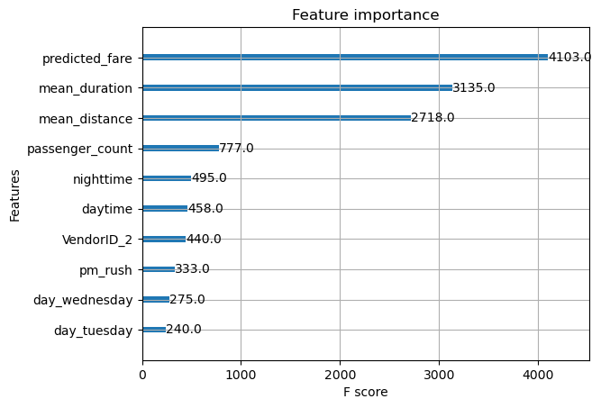

# Predicting High Rider Gratuity: Insights for Taxi Drivers to Enhance Earnings

## Skills

**Python - Data cleaning - Data visualization - Multiple linear Model Regression - Random Forest Classification - Tableau**

## Overview

The goal of this project was to create a multiple linear regression and random forest model to predict high rider gratuity or not. This project utilized yellow taxi trips taken in New York City during 2017. The final random forest model performed with 86% accuracy and 72% precision determining what features were most important in separating low tippers from high tippers. Based on the model, the duration, distance, and cost of the trip were most influential in determining a generous tipper (>20%) vs a non-generous one (<20%).

## Business Understanding

According to salary.com the average salary for a New York Taxi Driver is around $45,000. This salary is significantly low compared to a median rent value of $6,500 per month. It is important to understand what factors encourage riders to leave tips in order to help drivers obtain a livable wage.

## Data Understanding

The NYC Taxi and Limousine Commission data came from [NYC.gov](https://www.nyc.gov/site/tlc/about/tlc-trip-record-data.page). The data consisted of approximately 408k unique trips and 18 features. The features included information on trip duration and destination, vendor used, toll information, and payment type. The bar chart below shows the breakdown of how many generous tippers (>20%) versus non-generous tippers that exist in the data set.

<!--  -->

In connection to this, a feature was engineered to represent if a ride was taken during rush hour or not. Multiple redundant columns were dropped and reformatted into the proper data type.

## Modeling and Evaluation

A random forest model comprising 100 decision trees was used to determine feature importance in who would tip generously or not. The below plot shows that trip duration, distance, and the cost of a fare were the Top 3 most important factors in determining a generous tipper from a non-generous one. The overall model performed with 86% accuracy and 72% precision.

### Conclusion

This model can benefit Taxi Drivers in knowing if they will be tipped generously or not; however, running a parametric model to determine how much each variable will influence the actual price of the tip. In the future, adding more information on a rider’s past tipping behavior may also be beneficial in helping the stakeholder address their business problem.

⚠️ **This project comes from the Google certificat: Advanced Data Analyst** ⚠️