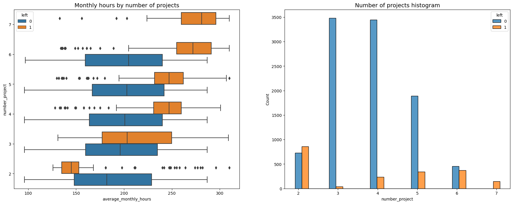
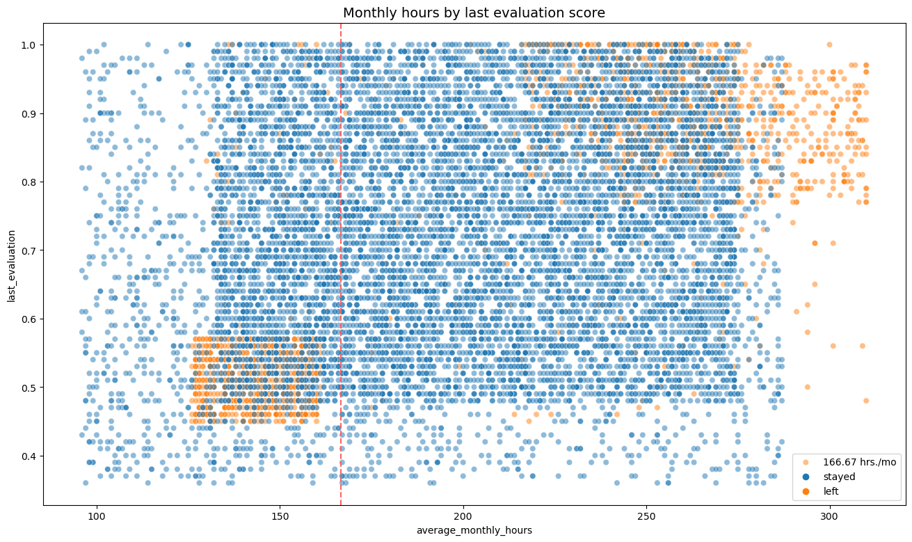
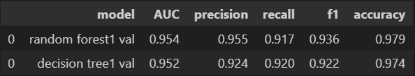

# Employee Turnover Prediction and Retention Strategy Development

## Skills

**Python - Data cleaning - Data visualization - Logistic Model Regression - Random Forest Classification**

## Overview
In this fictional scenario, Salifort Motors is grappling with a significant challenge: a high rate of employee turnover. This includes both employees opting to leave and those being let go. The company is committed to fostering a corporate culture that bolsters employee success and professional growth, making this issue particularly troubling. Beyond the impact on company culture, the financial implications are substantial. Salifort invests heavily in the recruitment, training, and upskilling of its employees, meaning each departure represents a significant cost.

## Business Understanding
In large companies, employee turnover can pose significant challenges and come with substantial costs. Such organizations often invest heavily in their workforce through training and development programs, making the loss of employees, especially skilled ones, a considerable setback. High turnover rates can also disrupt workflow, decrease productivity, and negatively impact employee morale, as consistent changes in personnel can create an unstable work environment. Additionally, the costs associated with hiring replacements - from advertising vacancies, conducting interviews, to onboarding and training new hires - are significant. Large companies also have to grapple with the loss of institutional knowledge that departing employees take with them. Therefore, understanding and reducing turnover is a critical focus for many large organizations

## Data understanding
The data to be analyzed will be gathered from the employee survey conducted by the HR department. The survey will likely contain a wealth of information that can be utilized to address the problem, including job title, department, number of projects, average monthly hours, and other relevant data points. This information is integral to understanding the patterns and trends related to employee turnover.

The fisrt analysis possible to see is that people who work on more projects would also work longer hours. 
This appears to be the case here, with the mean hours of each group (stayed and left) increasing with number of projects worked. 

The graph reveals two distinct groups of departing employees: high-performers who worked extensively, and lower performers who worked less than 166.67 hours. It suggests a correlation between hours worked and evaluation scores, yet it also shows that longer hours don't necessarily lead to higher scores. Notably, the majority of employees work more than 166.67 hours per month.

## Modeling and evaluation

**Logistic Regression**

The logistic regression model achieved precision of 80%, recall of 83%, f1-score of 80% (all weighted averages), and accuracy of 83%, on the test set.

**Tree-based Machine Learning**

After conducting feature engineering, the decision tree model achieved AUC of 94.3%, precision of 86.5%, recall of 91.5%, f1-score of 88.9%, and accuracy of 96.2%, on the test set. The random forest modelslightly outperformed the decision tree model.

## Conclusion
The analysis indicates that overwork is a key issue at the company. To improve employee retention, recommendations include: limiting the number of projects per employee, considering promotions for employees with four or more years of tenure, adjusting compensation or expectations for long work hours, clarifying overtime policies and expectations, facilitating discussions about work culture, and revising evaluation score guidelines to ensure fairness for those working fewer hours.

⚠️ **This project comes from the Google certificat: Advanced Data Analyst** ⚠️
